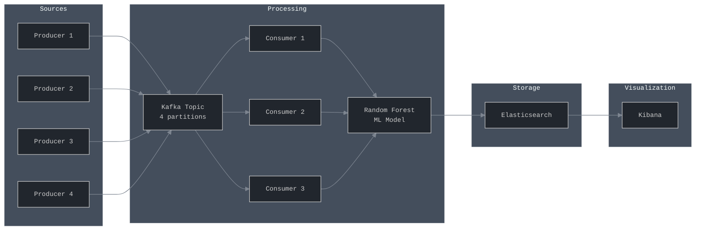

[](https://kafka.apache.org/)
[](https://www.elastic.co/)
[](https://www.elastic.co/kibana/)
[](https://python.org/)
[](https://docker.com/)

# 🚨 Real-Time Anomaly Detection Pipeline

> *Because manually checking logs is so 2019*

A streaming ML pipeline that catches network anomalies faster than you can say "zero-day exploit". Built with Kafka, scikit-learn, and enough caffeine to power a small datacenter.

## What It Does

- **Ingests**: Network events from 4 producers (variety is the spice of life)
- **Processes**: ML classification with Random Forest (it knows things)  
- **Visualizes**: Pretty Kibana dashboards that actually make sense
- **Scales**: Horizontally, because we're not monsters

## High Level Design



## Quick Start

```bash
# The essentials
conda create -n anomaly-detection python=3.9 -y
conda activate anomaly-detection
pip install -r requirements.txt

# Wake up the containers
docker-compose up -d

# Create Kafka topic (4 partitions for maximum throughput)
docker exec -it kafka kafka-topics --create \
  --topic anomaly-events \
  --bootstrap-server kafka:9092 \
  --partitions 4 --replication-factor 1

# Start producers (in separate terminals, or use tmux like a pro)
python producers/producer1.py
python producers/producer2.py  
python producers/producer3.py
python producers/producer4.py

# Start consumers (the real MVPs)
python consumers/consumer1.py
python consumers/consumer2.py
python consumers/consumer3.py

# Admire your creation
open http://localhost:5601
```

## Architecture

```
📡 Producers → 🌊 Kafka → 🤖 ML Consumers → 📊 Elasticsearch → 📈 Kibana
```

- **4 Producers**: Different personalities, same goal
- **1 Kafka Topic**: 4 partitions for parallel processing magic
- **3 Consumers**: Load balanced like a well-designed API
- **Random Forest**: The AI that actually works
- **Elasticsearch**: Your data's new best friend
- **Kibana**: Makes ugly data beautiful


## ML Model

Detects these attack types:
- **Benign** (the boring stuff)
- **Phishing** (digital fishing, but ruder)
- **Malware** (software with commitment issues)
- **Port Scan** (digital door-knocking)

**Features**: IP addresses, byte counts, timestamps, and mathematical relationships that would make Pythagoras proud.

## Cleanup

```bash
# Nuclear option
rm -rf ./data ./logs ./elasticsearch-data ./kafka-data ./kibana-data

# Graceful shutdown  
docker-compose down -v
```

## Future Improvements

- Multi-broker Kafka (because SPOF is scary)
- Kubernetes deployment (enterprise swagger)
- Real-time alerting (3 AM notifications, anyone?)
- More ML models (because one is never enough)

**Pro tip**: In cybersecurity, paranoia isn't a bug—it's a feature! 🔐
